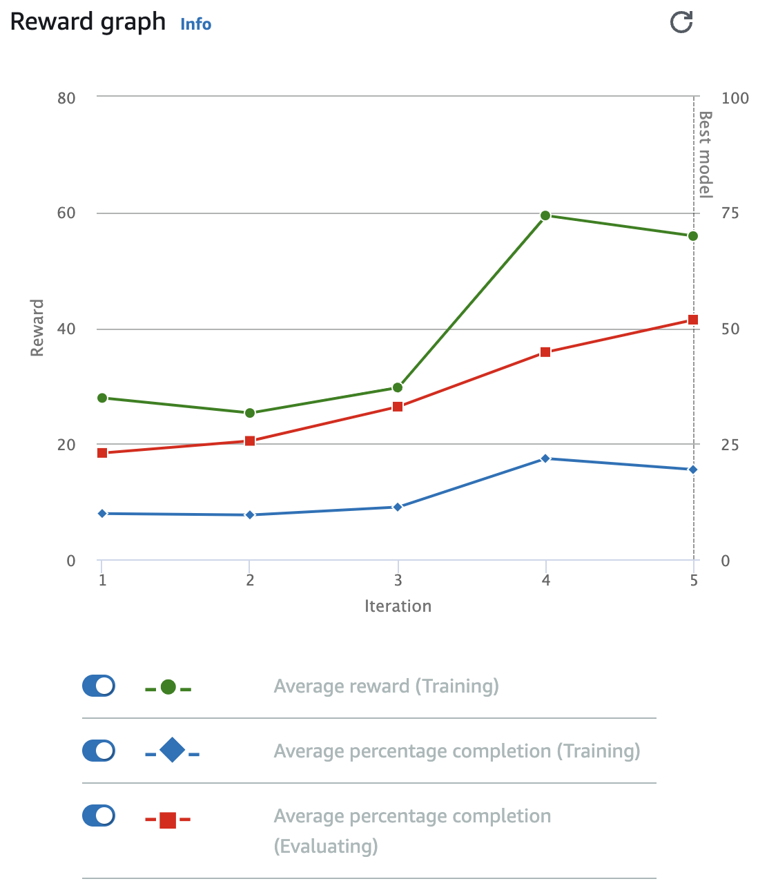

# Autonomous_Driving_RL

### First_trial

|Platform|Action space type|Action space|Reinforcement learning algorithm|
|:--|:--|:--|:--|
|AWS|Continuous|Speed : [0.5:1]m/s, Steering angle: [-30:30]|PPO|

|Hyperparameter|Value|
|:--|:--|
|Gradient descent batch size|64|
|Entropy|0.01|
|Discount factor|0.999|
|Loss type|Huber|
|Learning rate|0.0003|
|Number of experience episodes between each policy-updating iteration|20|
|Number of epochs|10|

### Reward Graph
학습시간 : 30분  

